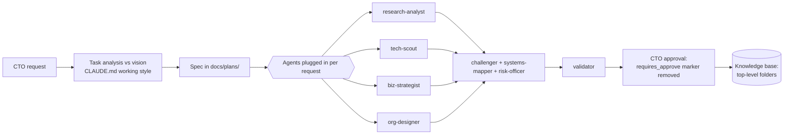

# agents/

The CTO's personal AI team: agents with different skills, plugged in per request — to **validate**, **challenge**, and **conduct researches**. This implements the vision thesis "AI as a personal team with different skills" from the [Vision of AI-assisted CTO](../personal/vision-ai-assisted-cto.md); the request itself is recorded in [collaboration-principles.md](../personal/collaboration-principles.md).

Status: **proposed specs, not approved** — treat as context while the `requires_approve` marker is present.

The team is **installed as real Claude Code subagents** in `.claude/agents/` (one file per agent, same names) — Claude Code picks them up automatically per request, or invoke explicitly ("use the challenger agent on this"). The specs here remain the source for those system prompts.

## How the team is used

Not every request needs the full chain: pick the minimal set, but a heavy research (see [research-backlog.md](../personal/research-backlog.md)) normally passes challenge and validation before being offered for approval.

## The team

| Agent | Role in one line |
|---|---|
| [research-analyst.md](research-analyst.md) | Deep multi-source research; produces overview/specific/case docs |
| [challenger.md](challenger.md) | Adversarial partner: attacks assumptions, meanings and vision-fit |
| [systems-mapper.md](systems-mapper.md) | Models the system: constraints, feedback loops, leverage points |
| [tech-scout.md](tech-scout.md) | Fast immersion into technologies and trends; radar duty |
| [validator.md](validator.md) | Verifies facts, links and claims; prepares docs for approval |
| [biz-strategist.md](biz-strategist.md) | Business lens: P&L, discovery, market, IT-strategy alignment |
| [org-designer.md](org-designer.md) | Org structure, team topologies, grades, competency matrices |
| [risk-officer.md](risk-officer.md) | Risk lens: pre-mortems, risk registers, AI risks |

## References

- [personal/vision-ai-assisted-cto.md](../personal/vision-ai-assisted-cto.md) — why the team exists
- [personal/collaboration-principles.md](../personal/collaboration-principles.md) — the CTO's request for agent specs
- [docs/consultant-stance.md](../docs/consultant-stance.md) — shared toolkit and reference minds
- [CLAUDE.md](../CLAUDE.md) — doc conventions every agent output must follow
